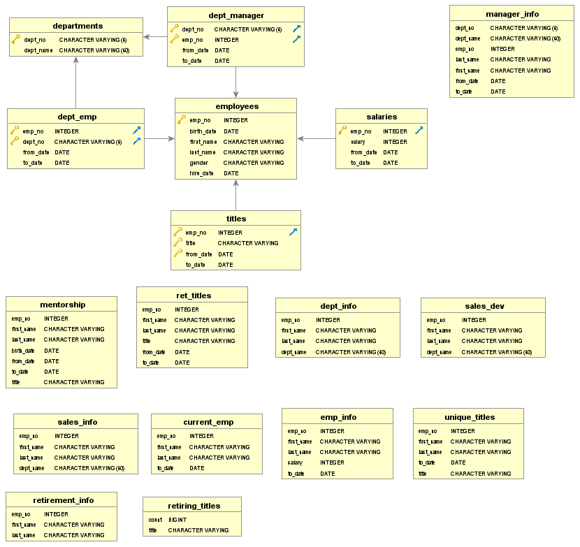

## Pewlett-Hackard-Analysis
PostgreSQL and PGadmin

Analyze the PewLett-Hackard employee data to determine who is elibible for retirement (by department, and job title) and who is eligible for the mentorship program.

### Part One: create and link the tables in the PostgreSQL database 
First all the tables were defined using SQL and the data imported from CSV in the RDBMS.  We had tables for employees, departments, employees by departments, employee salaries, employee titles, and department managers.

Entity relation diagram (ERD):

### Part two: query the RDBMS to identify employees of retirement age by department and title, and those eligible for the mentorship program.
We created several queries by (INNER) joining tables and outputting fields from the joined data.  We used WHERE to select data by certain criteria (e.g. age based on employee birth date and hire date).  We then used a query within a query to exclude duplicates (using the PARTITION command). We then downloaded the query results to .csv files (in the data sub-directory). (Deliverable 1 = unique_titles.csv, Challenge.sql).

Then we queried the RDBMS to identify those employees eligible for the mentorship program (those born in 1965) by (INNER) joining the employees and employee by department, and titles tables and using criteria employment to_date indicating current employment (i.e.'9999-01-01') and birth year equal to 1965 (and deduplicating).  The resulting downloaded csv file is called 'mentorship' which constitutes Deliverable 2 (also located in the "Data" sub-directory.

